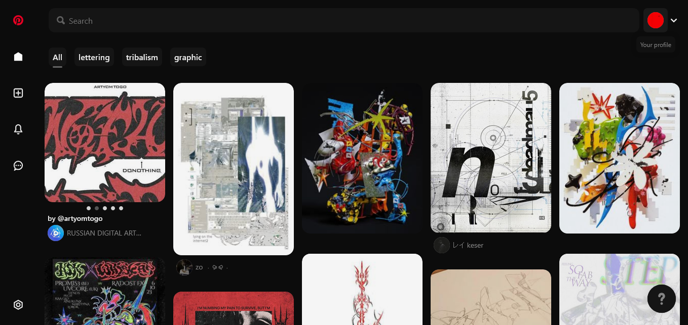
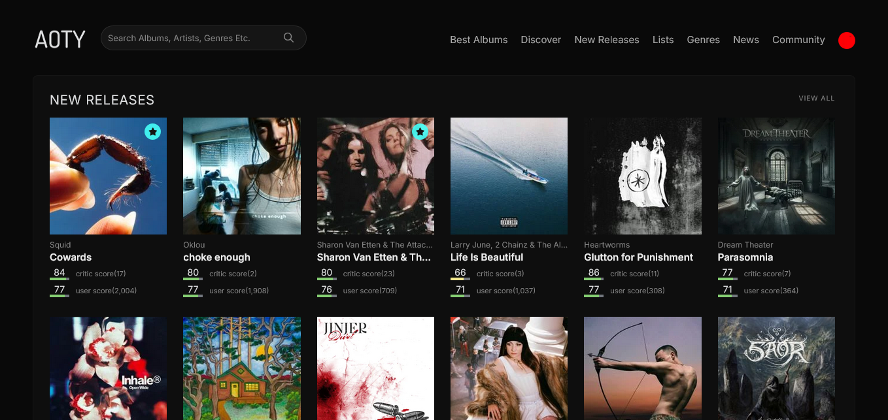
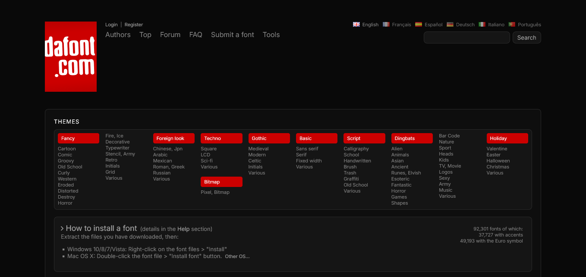
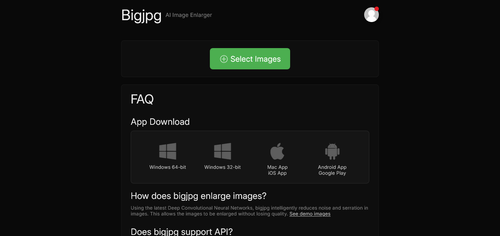

# woidzero/userstyles

all of my userstyles

    
    
    

## installation

to install any of these styles you need [Stylus](https://github.com/openstyles/stylus#stylus) or other userstyle manager.

## styles

re-Pinterest
re-styled pinterest.com / only dark mode

 

re-AOTY
re-styled albumoftheyear.org / only dark mode

 

re-Dafont
re-styled dafont.com / only dark mode

 

re-Bigjpg
re-styled bigjpg.com / only dark mode

 

## license

see [LICENSE](LICENSE) for details
